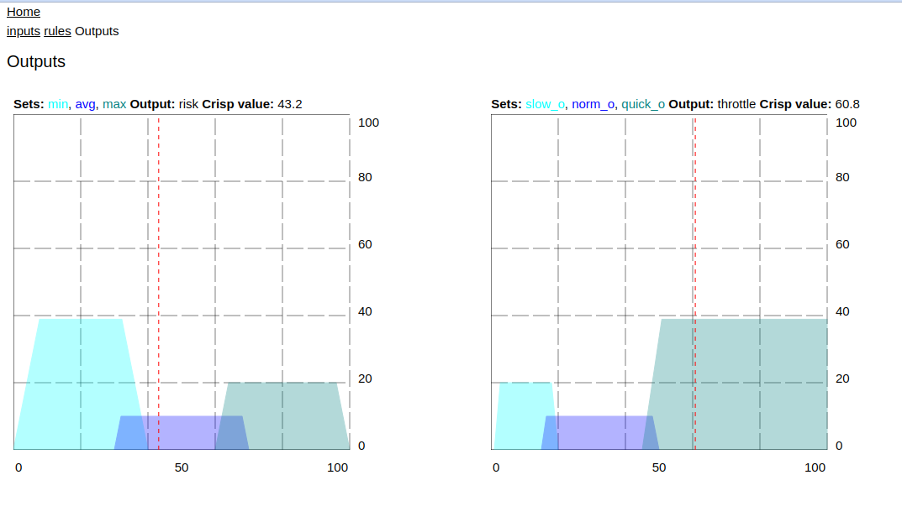

# eFLL  (embedded Fuzzy Logic Library)

An adaption of the [Embedded Fuzzy Logic Library](https://github.com/zerokol/eFLL) to Toit.  

Still very much a work in progress.  

## Visualization of models

A toy web server provides visualization of the execution of the fuzzy models.  
The code runs on either the host or device.
- run the webserver in examples, e.g. `jag run -d host server.toit`
- look at the URL printed to the console, like: `Open a browser on: http://192.168.0.130:8080`
- a model index will be shown, click the links to view the models (currently driver, driver_advanced, casco)
- on the inputs page, move the sliders to change inputs, then click the 'outputs' link, to view the results

### ToDos
- rework test cases to current API
- implement Fuzzy Control Language (FCL) file reader
- rework API, to minimum FCL requirements
- resolve the result discrepancies (<1%) in the test suite, between the .cpp and .toit implementations, reference [FuzzyLite](https://www.fuzzylite.com/)
