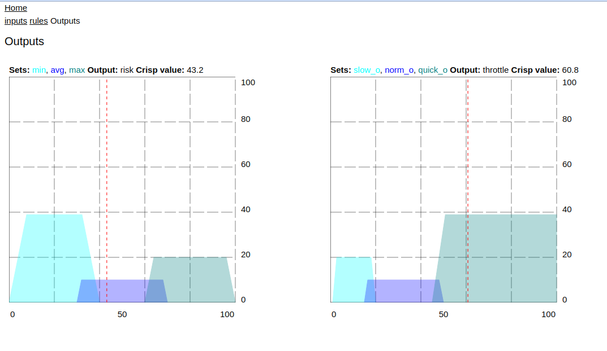

# eFLL  (embedded Fuzzy Logic Library)

An adaption of the [Embedded Fuzzy Logic Library](https://github.com/zerokol/eFLL) to Toit.  

## Visualization of models

A toy web server provides visualization of the execution of the fuzzy models.  
The server can run on either host or device.
- run the webserver in examples, e.g. `jag run -d host server.toit`
- look at the URL printed to the console, like: `Open a browser on: http://192.168.0.130:8080`
- a model index will be shown, click the links to view the models (currently driver, driver_advanced, casco, fan speed, air-conditioning)
- on the inputs page, move the sliders to change inputs, then click the 'outputs' link, to view the results

### ToDos
- rework test cases to current API
- implement Fuzzy Control Language (FCL) file reader
- rework API, to minimum FCL requirements
- resolve the result discrepancies (<1%) in the test suite, between the .cpp and .toit implementations, reference [FuzzyLite](https://www.fuzzylite.com/)

#### Links
* [How to tell whether a point is to the right or left side of a line](https://stackoverflow.com/questions/1560492/how-to-tell-whether-a-point-is-to-the-right-or-left-side-of-a-line)
* [svg, polyline](https://developer.mozilla.org/en-US/docs/Web/SVG/Element/polyline)
* [How do I combine complex polygons?](https://stackoverflow.com/questions/2667748/how-do-i-combine-complex-polygons)
* [Subtract Rectangle from Polygon](https://mathoverflow.net/questions/111296/subtract-rectangle-from-polygon/111323#111323)
* [polygon union without holes](https://stackoverflow.com/questions/6844462/polygon-union-without-holes)
* [polybooljs](https://github.com/velipso/polybooljs)
* [Polygons and meshes](http://paulbourke.net/geometry/polygonmesh/)
* [Polygon Clipping (Part 2)](https://sean.cm/a/polygon-clipping-pt2)
* [Shoelace formula](https://en.wikipedia.org/wiki/Shoelace_formula)

* [jFuzzyLogic](https://jfuzzylogic.sourceforge.net/html/manual.html)
* [fuzzylite](https://www.fuzzylite.com/)

* [Free HTML pretty printer](https://www.freeformatter.com/)

#### Notes:

To calculate the weighted centroid of the composite polygon, you can follow these steps:  
 - Compute the area and centroid of each individual polygon using the formulae for polygon area and centroid.
 - Compute the total area of the composite polygon by summing the areas of the individual polygons.
 - Compute the weighted centroid of each individual polygon by multiplying its centroid coordinates by its area.
 - Sum the weighted centroids of all individual polygons.
 - Divide the sum of the weighted centroids by the total area of the composite polygon to obtain the centroid coordinates of the composite polygon.

By following these steps, you can obtain the centroid of the composite polygon as the sum of the weighted centroids of the individual polygons.

2. Samples:

`java -jar jFuzzyLogic.jar -e ./fuzzy_logic/examples_fcl/ip.fcl -1.2 -7 0.75 -2.3`  
`java -jar jFuzzyLogic.jar -e ./fuzzy_logic/examples_fcl/z.fcl 3.5 6.5`